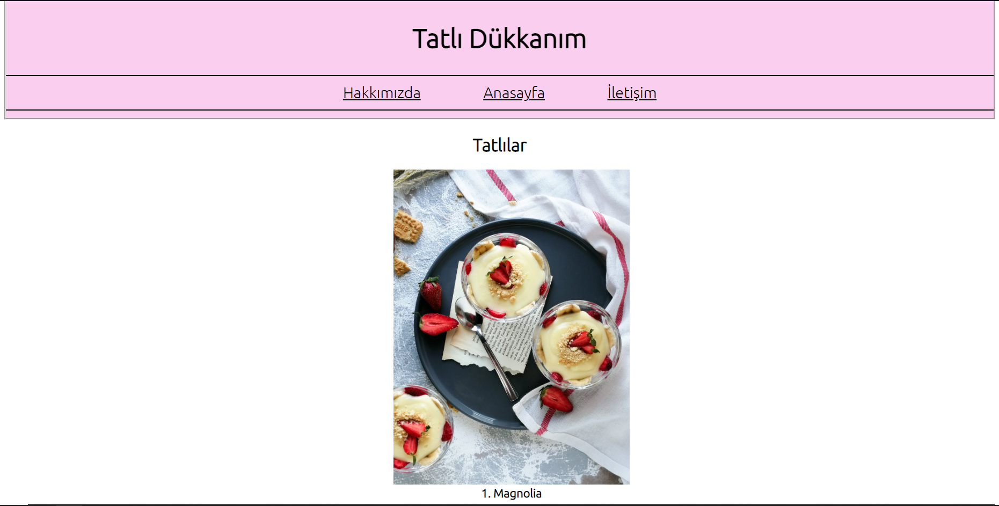

# CSS-Odev
 CSS Eğitimi kapsamında verilen ödev 
# İçerik
İçerisinde 4 tane farklı .html sayfası ve bir adet .css dosyası bulunmaktadır. CSS kodlarını kullanma bakımından 3 adet farklı yolu da kullandım projede( Inline(Etikete Özel), Internal(Aynı Dosyada) ve External(CSS Dosyasında)) 
İçerisinde görsellerin bulunduğu bir dosya bulunmaktadır.
# Ekran Görüntüsü
